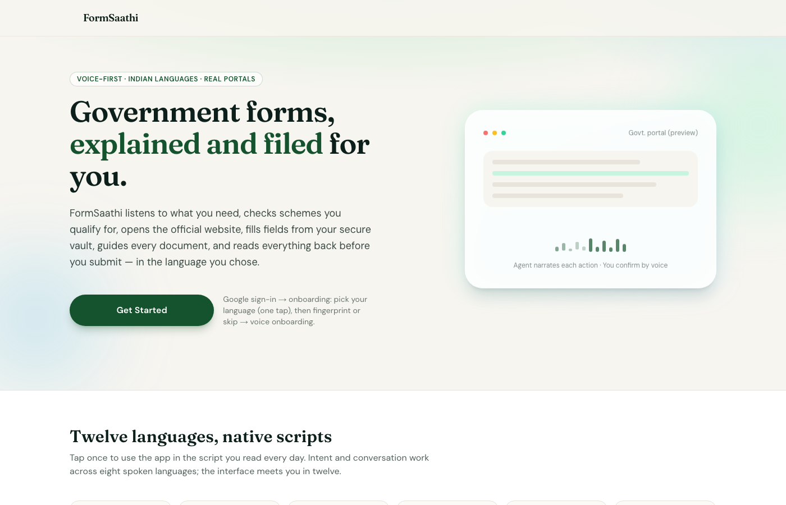

# FormSaathi

**Government forms, in your language. Powered by an AI agent.**

FormSaathi is an **agentic AI assistant** with **15 autonomous tools** that helps Indian citizens navigate government schemes, fill offline forms, and get guided help through online applications — all by voice, in their preferred language.

Built on **OpenRouter** with **agentic engineering** principles: the AI doesn't just answer questions — it reasons, plans, and takes actions using a server-side tool-calling loop.

<p align="center">
  <a href="https://form-saathi-one.vercel.app">
    
  </a>
</p>

<p align="center">
  <a href="https://form-saathi-one.vercel.app"><strong>Try it live</strong></a>
</p>

---

## Why Agentic?

This isn't a chatbot with a prompt. FormSaathi runs a **server-side agentic loop** where the AI:

1. Receives a user message (text or voice)
2. Reasons about what tools to call
3. Executes tools autonomously (scan documents, query schemes, fill PDFs, guide through websites)
4. Returns results and decides if more actions are needed
5. Loops until the task is complete

The agent has **15 tools** it can call in any combination, any order, without human intervention. One user message can trigger 5+ tool calls behind the scenes.

---

## The Problem

Millions of Indians are eligible for government welfare schemes but never apply because:
- Forms are in languages they can't read
- The process is confusing and bureaucratic
- Online portals are hard to navigate
- They don't know which schemes they qualify for

## What FormSaathi Does

### 1. Speak Your Language
Pick from 13 Indian languages. Everything changes — the UI, the voice, the forms.

### 2. Scan Your Aadhaar
The agent uses **vision tools** to OCR your Aadhaar card — extracting name, DOB, gender, address, Aadhaar number. All encrypted on-device.

### 3. Find Your Schemes
The agent **autonomously matches** your profile against 50+ central government schemes and tells you what you qualify for.

### 4. Fill Offline Forms
Upload a physical form. The agent:
- Detects the form language via **vision OCR**
- Extracts every field
- Auto-fills from your profile using **multilingual alias matching**
- Asks for anything missing — by voice
- Generates a filled PDF

### 5. Guide Through Online Applications
The agent sees your screen via **screen share analysis**, speaks step-by-step instructions, and dictates your details field by field.

---

## Architecture — Agentic Loop

```
User (Voice/Text)
       |
       v
  Next.js API Route (/api/agent/chat)
       |
       v
  ┌─────────────────────────┐
  │   AGENTIC LOOP          │
  │                         │
  │  1. Build system prompt  │
  │  2. Call OpenRouter       │
  │     (Gemini 2.5 Flash)   │
  │  3. Parse tool calls      │
  │  4. Execute tools (1-N)   │
  │  5. Append results        │
  │  6. Loop until done       │
  └─────────────────────────┘
       |
       v
  Response + TTS (OpenRouter)
```

**Key design decisions:**
- **Server-side agentic loop** — API keys stay on server, tools execute server-side, the model decides when to stop
- **OpenRouter as the inference layer** — single API for Gemini 2.5 Flash (text, vision, tool calling) and OpenAI GPT-Audio (TTS)
- **No server-side user data** — everything encrypted in IndexedDB on the device
- **Single model for everything** — Gemini 2.5 Flash handles text, vision, tool calling, and multilingual reasoning
- **Voice-first UX** — big mic button, auto-TTS on every page

## Tech Stack

| Layer | Technology |
|-------|-----------|
| Framework | Next.js 15 (App Router) |
| Auth | Clerk (Google OAuth) |
| **AI Inference** | **OpenRouter** (unified API gateway) |
| **Agent Model** | **Gemini 2.5 Flash** (text + vision + tool calling) |
| **TTS** | **OpenAI GPT-Audio** via OpenRouter |
| **STT** | **Gemini 2.5 Flash** via OpenRouter |
| **Architecture** | **Agentic loop with 15 autonomous tools** |
| PDF Generation | pdf-lib |
| Encryption | Web Crypto API (AES-GCM) |
| Storage | IndexedDB (on-device only) |
| i18n | i18next + react-i18next |
| Styling | Tailwind CSS |

## Agent Tools (15)

The agent can call these tools autonomously in any combination:

| Tool | What it does |
|------|-------------|
| `get_user_profile` | Read profile from encrypted vault |
| `update_user_profile` | Save new fields to vault |
| `find_eligible_schemes` | Match profile against 50+ schemes |
| `get_scheme_details` | Get scheme info, portal URL, form fields |
| `translate_text` | Translate between any supported languages |
| `scan_document` | Vision OCR on Aadhaar cards, forms, documents |
| `detect_form_language` | Identify form language and script |
| `extract_form_fields` | Pull all field labels, types, and positions |
| `fill_form_fields` | Match fields to profile via multilingual alias table |
| `generate_filled_pdf` | Create filled PDF for download |
| `analyze_screenshot` | Understand what's on a government website |
| `generate_guidance` | Speak step-by-step instructions for online forms |
| `request_camera` | Ask user to open camera |
| `request_screen_share` | Prompt screen sharing |
| `request_voice_input` | Ask user to speak |

## Privacy

- All personal data is encrypted with AES-GCM and stored only in IndexedDB
- Encryption key lives in localStorage — if cleared, data is unrecoverable (by design)
- No user data is stored on any server
- Aadhaar images are processed via OpenRouter's API and never stored

## Getting Started

```bash
git clone https://github.com/RinN0Sekai/FormSaathi.git
cd FormSaathi
npm install
```

Create `.env.local`:
```env
NEXT_PUBLIC_CLERK_PUBLISHABLE_KEY=pk_test_...
CLERK_SECRET_KEY=sk_test_...
OPENROUTER_API_KEY=sk-or-v1-...
```

```bash
npm run dev
```

Open [http://localhost:3000](http://localhost:3000).

## Supported Government Schemes (50+)

Ration Card (NFSA), PM-KISAN, PM Fasal Bima Yojana, PM Awas Yojana, Sukanya Samriddhi Yojana, PM Matru Vandana Yojana, National Pension Scheme, Ayushman Bharat, PM Ujjwala Yojana, Soil Health Card, National Scholarship Portal, PM Mudra Yojana, Stand-Up India, Skill India, and many more.

## License

MIT
